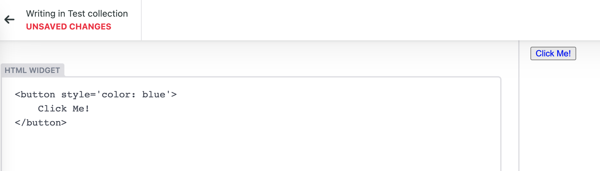

# netlify-cms-widget-html

Plain html editor for netlify-cms.



## Features

- [x] Support store external images into base64 code.
- [ ] Support store external images into files in media_folder(developing).

## Usage

```typescript
import CMS from 'netlify-cms-app'
import { HtmlControl, HtmlPreview } from 'netlify-cms-widget-html'
// Initialize the CMS object
CMS.init()
// Now the registry is available via the CMS object.
cms.registerWidget('html', HtmlControl, HtmlPreview)
```

## Example

### Next.js

Create `src/pages/admin/` folder, with files:

```bash
admin
 ├ index.tsx
 └ config.json
 ```

index.tsx:

```typescript
import dynamic from 'next/dynamic';
import config from './config.json'

const CMS = dynamic(
  () =>
    import('netlify-cms-app').then(async (cms: any) => {
      const { HtmlControl, HtmlPreview } = await import('netlify-cms-widget-html')
      cms.init({ config });
      cms.registerWidget('html', HtmlControl, HtmlPreview)
    }) as any,
  { ssr: false, loading: () => <p>Loading...</p> }
);

const AdminPage: React.FC = () => {
  return <>
    <div id='nc-root' />
    <CMS />
  </>
};

export default AdminPage;
```

Custom `config.json` as your wish, check [netlify-cms configuration options](https://www.netlifycms.org/docs/configuration-options/).
